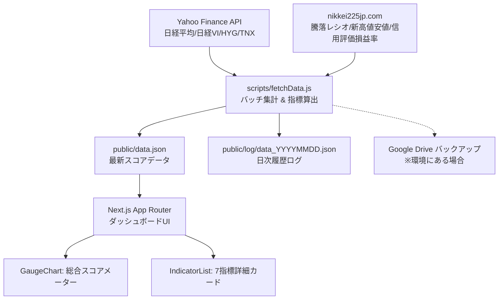

# Fear & Greed Index for Japan 🇯🇵

日本市場（日経平均株価・東証プライム）における投資家心理「恐怖（Fear）」と「強欲（Greed）」を7つの独自指標から算出し、直感的なゲージメーターと詳細カードで可視化する Next.js ダッシュボードアプリケーションです。

---

## 📌 概要

米CNNの Fear & Greed Index のコンセプトを日本株式市場（日経平均・東証プライム）向けに最適化。
独自のデータ収集バッチ（Node.js）が市場データ・テクニカル指標・信用需給データを自動取得・解析し、0〜100の総合センチメントスコアと5段階の市場心理レーティングを算出します。



---

## 📊 7つの構成指標 (Market Indicators)

本指数は、日本市場の需給・テクニカル・ボラティリティ・グローバルリスク選好度を網羅する **7つの構成指標** の単純平均から算出されます。

| 指標名 | 内容・算出ロジック | データソース | フォールバック処理 |
| :--- | :--- | :--- | :--- |
| **1. Market Momentum**<br>（市場の勢い） | 日経平均株価と125日移動平均線の乖離率（±10%を0〜100に正規化） | Yahoo Finance (`^N225`) | - |
| **2. Stock Price Strength**<br>（株価の強さ） | 東証プライム市場の新高値銘柄数 / (新高値＋新安値) の比率 | nikkei225jp.com | 日経平均の52週高値・安値に対する現在位置 |
| **3. Stock Price Breadth**<br>（市場の広がり） | 東証プライム市場の25日騰落レシオ（70%〜130%を0〜100に正規化） | nikkei225jp.com | 過去20営業日の日経平均上昇日数割合 |
| **4. Margin Trading Sentiment**<br>（信用取引心理） | 個人投資家の信用評価損益率（-18%〜-3%を0〜100に正規化） | nikkei225jp.com | 中立（50スコア）固定 |
| **5. Junk Bond Demand**<br>（ジャンク債需要 / リスク選好） | 米国ハイイールド債ETF (`HYG`) の50日移動平均乖離トレンド | Yahoo Finance (`HYG`) | - |
| **6. Market Volatility**<br>（市場ボラティリティ） | 日経平均ボラティリティ・インデックス（日経平均VI 15〜40を100〜0に反転正規化） | Yahoo Finance (`^NKVI.OS`) | - |
| **7. Safe Haven Demand**<br>（安全資産需要） | 株式（日経平均）の直近20営業日リターン（リスク資産への選好度） | Yahoo Finance (`^N225`) | - |

---

## 🎯 スコアとレーティング基準

総合スコア（0〜100）に基づき、市場心理を以下の5段階に分類します。

| スコア範囲 | レーティング | 意味・市場環境 |
| :---: | :--- | :--- |
| **75 〜 100** | 🟢 **Extreme Greed**（極度の強欲） | 過熱感・過度な楽観（反落リスクへの警戒ゾーン） |
| **55 〜 74** | 🟢 **Greed**（強欲） | リスクオン傾向・買い優勢 |
| **45 〜 54** | 🟡 **Neutral**（中立） | 均衡・方向感の模索 |
| **25 〜 44** | 🔴 **Fear**（恐怖） | リスクオフ傾向・売り優勢 |
| **0 〜 24** | 🔴 **Extreme Fear**（極度の恐怖） | 総悲観・パニック売り（逆張り買い検討ゾーン） |

---

## 🛠️ 技術スタック

- **フレームワーク**: [Next.js 16](https://nextjs.org/) (App Router, Server Components)
- **UI / スタイリング**: [React 19](https://react.dev/), [Tailwind CSS v4](https://tailwindcss.com/), [Lucide React](https://lucide.dev/)
- **チャート描画**: [Recharts](https://recharts.org/)（半円型カスタムゲージチャート）
- **データ取得・解析**: Node.js, `yahoo-finance2`, 原型スクレイピング (`vm` 仮想コンテキスト実行)
- **タイムゾーン管理**: JST (+09:00) 固定管理

---

## 🚀 セットアップ & 実行手順

### 1. リポジトリの準備と依存パッケージのインストール
```bash
cd fear_and_greed_index_for_jp
npm install
```

### 2. 市場データの取得・指数算出（初回実行）
Next.js アプリを起動する前に、データ取得スクリプトを実行して `public/data.json` を生成します。
```bash
node scripts/fetchData.js
```
> **実行結果**:
> - `public/data.json` が最新データで更新されます。
> - `public/log/data_YYYYMMDD.json` に日次履歴が記録されます。
> - ※Chromebook環境等で `/mnt/chromeos/GoogleDrive/MyDrive/Linuxファイル/` が存在する場合、自動的にバックアップが保存されます。

### 3. Webダッシュボードの起動

#### 開発モード
```bash
npm run dev
```
ブラウザで [http://localhost:3000](http://localhost:3000) にアクセスします。

#### 本番ビルド・起動
```bash
npm run build
npm start
```

---

## ⏰ Cron による定期自動更新（運用設定）

市場の引け後（例: 毎日 18:00）に自動でデータを収集・更新する運用が推奨されます。

```bash
crontab -e
```

以下の設定を追加します（パスはご自身の環境に合わせて変更してください）:
```cron
# 毎日 18:00 にデータ更新スクリプトを実行
0 18 * * * /usr/bin/node /absolute/path/to/fear_and_greed_index_for_jp/scripts/fetchData.js >> /absolute/path/to/fear_and_greed_index_for_jp/cron.log 2>&1
```

---

## 📁 ディレクトリ構成

```text
fear_and_greed_index_for_jp/
├── docs/                     # 開発・運用メモ
├── public/
│   ├── data.json             # Webアプリが読み込む最新の算出データ
│   └── log/                  # 日次履歴ログ (data_YYYYMMDD.json)
├── scripts/
│   └── fetchData.js          # データ収集・指標計算・JSON生成スクリプト
├── src/
│   ├── app/
│   │   ├── layout.js         # ルートレイアウト
│   │   ├── page.js           # メインダッシュボード（force-dynamic）
│   │   └── globals.css       # グローバルCSS
│   └── components/
│       ├── GaugeChart.js     # 総合スコアの半円ゲージチャート
│       └── IndicatorList.js  # 7指標カードリスト
└── package.json
```

---

## 🔗 関連プロジェクト

- **[`n225-fear-and-greed-graph`](../n225-fear-and-greed-graph)**:
  本プロジェクトが出力する `public/log/data_YYYYMMDD.json` の日次履歴を参照し、時系列推移グラフを表示する連携ビューア。

---

## ⚠️ 免責事項

- 本ツールが提供する指数およびデータは、投資判断の参考情報提供のみを目的としており、特定の金融商品の売買を推奨・勧誘するものではありません。
- データの正確性・完全性には配慮していますが、外部データソースの仕様変更等により数値に変動が生じる場合があります。投資判断は必ず自己責任において行ってください。
